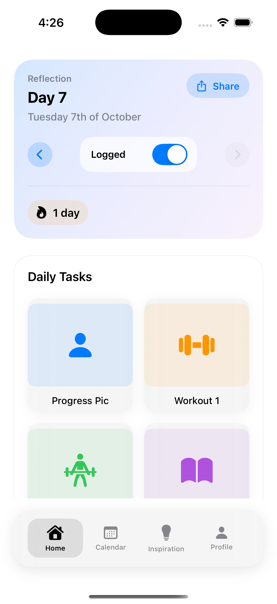

//
//  README.md
//  75Progress
//
//  Created by Happiness Adeboye on 6/10/2025.
//


Githublink: https://github.com/happi2206/75progress

Documentation: https://docs.google.com/document/d/1pwKTDKtGZoUPGevhv4d2PjXfihXtL0roJSztZCAtGrc/edit?usp=sharing


# 75 Progress — Final Project Submission

> Build & run on iOS 17+ 

## Overview
**75 Progress** helps you complete a **75‑day consistency challenge** inspired by the program created by **Andy Frisella**. The app prioritizes *discipline, habit formation, and daily accountability* with a clean, modern iOS experience.

### Daily rules (standard 75 Hard)
- **Two workouts** (one must be **outdoors**)
- **Follow a diet** (no cheat meals, **no alcohol**)
- **Drink 1 gallon (~3.8 L) of water**
- **Read 10 pages** of non‑fiction/self‑improvement
- **Take a daily progress photo**  
If you miss any requirement, you restart at **Day 1**.

> Disclaimer: 75 Progress is an independent tool and is **not affiliated with or endorsed by** Andy Frisella or his companies.

---

## How to Run (Marker Instructions)
1. Open the project in **Xcode 16+**.
2. Select an **iOS 17+** simulator (or a device).
3. **Build & Run.**
   - The app auto‑configures Firebase using the bundled `GoogleService-Info.plist`.
   - It signs in **anonymously** on first launch — no accounts required.
   - First‑run onboarding appears (what/why/benefits → goals → name) and then the Today screen.

> If the machine is offline, the app still works locally (Core Data + UserDefaults). Cloud writes will succeed when a connection is available.

---

## Feature Map (What to Look For)
- **Onboarding**
  - Explains the challenge (creator, benefits, why 75 days, community hashtags).
  - **Goal chips** (e.g., Lose weight, Build strength, Mental resilience).
  - **Name capture** with validation (2–24 letters; editable later).
- **Today Screen**
  - Daily checklist with quick logging for each requirement.
  - **Pinned bottom bar**: **Save logged day** and **Share**.
  - **Celebration popup** after saving — “Woohoo!”, shows **current streak** and **days left** to 75.
  - **Correct English ordinals** in dates (e.g., “Saturday **4th** of October”).  
- **Calendar**
  - View history; share from any day (same share flow as Today).
- **Photos & Cloud Sync**
  - Attach a progress photo → uploaded to **Firebase Storage** under the user + date.
  - A `photoURLs` array is appended to Firestore doc: `users/{uid}/dayLogs/{yyyy-MM-dd}`.
- **Offline‑first**
  - Local save happens immediately; cloud sync is best‑effort with friendly error toasts.
- **Accessibility**
  - VoiceOver labels for interactive elements; Dynamic Type friendly.

---

## Architecture & External Tools
- **Languages/Frameworks**: Swift, SwiftUI, **MVVM**
- **Local Data**: **Core Data** (day logs), **UserDefaults** (prefs, onboarding flag)
- **Cloud**: **Firebase Auth (Anonymous)**, **Firestore**, **Storage**
- **SPM**: Firebase SDKs (Auth, Firestore, Storage)
- **Utilities**: Date ordinal formatting; toast center; ISO day keys (`yyyy-MM-dd`)

### Data Shapes 
**Local `DayEntry`**
```
id: UUID
date: Date
isComplete: Bool
summary: String?
photos: [PhotoItem]  // local references
```
**Cloud `users/{uid}/dayLogs/{yyyy-MM-dd}`**
```
dateISO: String
photoURLs: [String]
updatedAt: serverTimestamp()
```

---


## Screenshots

<p align="center">
  
    
    
  
    
  
  
    
    
    
</p>


---

## Error Handling Strategy
- **Anonymous Auth** is attempted at launch; failures don’t block local usage.
- **Storage/Firestore** writes are wrapped in `try/await` with graceful fallback:
  - On failure: show a non‑blocking toast (user keeps working).
  - On success: update UI immediately.
- **Offline**: local save (Core Data) always works; cloud writes retry when connectivity returns (manual actions can be re‑invoked).

---


## Security & Privacy
- Client config (the plist) is **not a secret**; access is controlled by **rules**:
  - **Firestore rules**: users can only access their own `users/{uid}/**` docs.
  - **Storage rules**: users can only read/write files under `users/{uid}/**`.
- Data is stored locally and under the user’s Firebase UID. No third‑party sharing.
- This app does not provide medical advice.

---

## Developer Notes (for deeper review)
- **MVVM** separation: Views (SwiftUI), ViewModels (state/intent), repositories/services (Core Data & Firebase).
- **Per‑day keys**: `yyyy-MM-dd` via a centralized utility to keep local and cloud aligned.
- **Share flow**: single implementation reused between Calendar and Today to avoid duplication.
- **Polish**: animations, haptics, and correct English ordinals (handling 11th/12th/13th).
